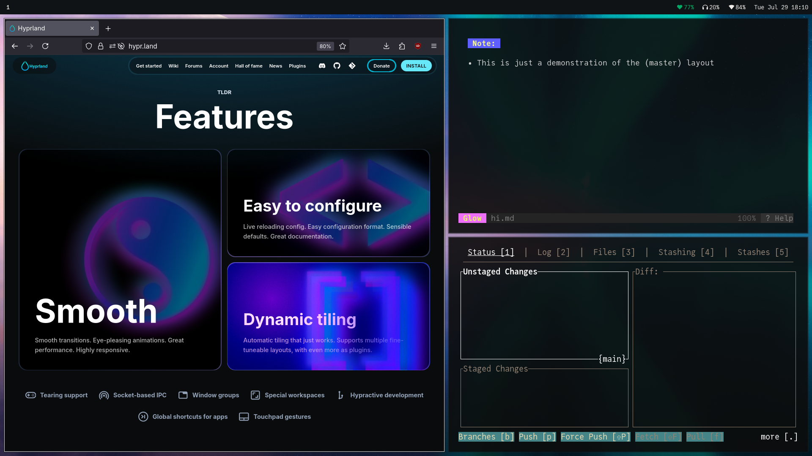

# Personal Dotfiles

## Core Programs Being Used (for Hyprland)
* [hyprpaper], [hyprlock], [hypridle], and [hyprpolkitagent]
* [ghostty]/[foot]
* [waybar]
* [bemenu] + [j4-dmenu-desktop]
* [dunst]
* [grim] + [slurp]
* [juliamono] (font of choice)

## Look and Feel

* [librewolf]
* [glow]
* [gitui]

* [rmpc]
* [timr-tui]

[hyprpaper]: https://github.com/hyprwm/hyprpaper
[hyprlock]: https://github.com/hyprwm/hyprlock
[hypridle]: https://github.com/hyprwm/hypridle
[hyprpolkitagent]: https://github.com/hyprwm/hyprpolkitagent
[ghostty]: https://ghostty.org
[foot]: https://codeberg.org/dnkl/foot
[waybar]: https://github.com/Alexays/Waybar
[bemenu]: https://github.com/Cloudef/bemenu
[j4-dmenu-desktop]: https://github.com/enkore/j4-dmenu-desktop
[dunst]: https://dunst-project.org/documentation/dunst
[grim]: https://sr.ht/~emersion/grim
[slurp]: https://github.com/emersion/slurp
[librewolf]: https://librewolf.net
[glow]: https://github.com/charmbracelet/glow
[gitui]: https://github.com/gitui-org/gitui
[rmpc]: https://mierak.github.io/rmpc
[timr-tui]: https://github.com/sectore/timr-tui
[juliamono]: https://juliamono.netlify.app
